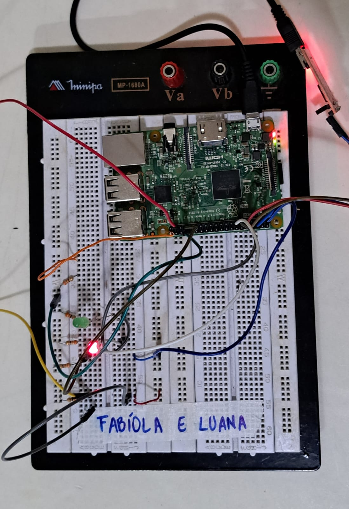

# Projeto Grau B
## Overview

Alunas: Fabíola Favero Seghetto e Luana Cristina Pündrich

Professor: Armando Leopoldo Keller

Disciplina: Sistemas Embarcados

## Contexto e Objetivos

O projeto foi apresentado para a disciplina de sistemas embarcados com o objetivo de realizar uma fila de atendimentos, implementada usando conceitos de programação embarcada com Linux e Buildroot.

O atual escopo do projeto é desenvolver uma fila de atendimentos de um hospital.

## Requisitos do projeto

- Aplicação compilada (ou somente carregada, caso seja interpretada) juntamente com a imagem do Linux (Builroot);
- Inicializar junto com o sistema;
- Interagir com o hardware de alguma maneira.

#### Requisitos da aplicação

- Atendimentos prioritários e normais devem ocorrer no mesmo guichê seguindo a ordem:
  - A cada 4 atendimentos prioritários, um normal é feito;
  - Menos de 4 atendimentos prioritários, todos serão servidos e seguem os atendimentos da fila normal.
- Impressão de log de incremento das filas:
  - Chegada de pacientes;
  - Atendimentos.
- Ambas filas e seus respectivos atendimentos são guardados no arquivo patients.txt;
- Arquivo de log deve ser recuperado durante inicializações.

## Hardware

#### Lista de materiasi

Os materiais escolhidos para o desenvolvimento do projeto foram:

- Raspberry pi 3;
- 3 botões;
- 1 X LED Vermelho;
- 1 X LED Verde;
- 5 X Resistor 150ohm 1/4W;

#### Circuitos

O circuito foi construido com os materiais listados anteriormente. O software foi desenvolvido posterior a montagem do hardware.



## Software

#### Especificações de linguagem
A linguagem escolhida foi c.

#### Fluxo

##### Diagrama de Sequência


Existem 4 tasks, ```ConfigTasks```, ```task1```, ```task2```,```task3``` e ```task4``` que acontecem de maneira simultânea. 

##### initializeFromPatientsQueueFile()
A responsabilidade dessa função é verificar se um arquivo chamado "patients.txt" existe.
Caso o arquivo não exista, ela o cria e inicializa as variáveis relacionadas às filas. Se existe, somente lê as variáveis do arquivo.

##### saveCurrentState()
A responsabilidade dessa função é salvar o estado atual das variáveis (filas e contadores), no arquivo "patients.txt".

##### servePatient(int patientType)
A responsabilidade dessa funcção é simular o atendimento dos pacientes, imprimindo informações na tela sobre o tipo  de paciente atendido (alta ou normal).

##### checkButtons()
A responsabilidade dessa função é verificar o estado dos botões para detectar se um paciente chegou. Além disso, quando um botão é pressionado, ela incrementa a fila correspondente e acende o LED correspondente à prioridade. Se o botão de atendimento é pressionado, verifica as filas para atender todos os pacientes.

##### checkQueues()
A responsabilidade dessa função é decidir qual paciente deve ser atendido com base nas regras estabelecidas:
- Atende pacientes de alta prioridade, se houver na fila, e se menos de 4 foram atendidos consecutivamente, ou se não houver pacientes de prioridade normal;
- Atende pacientes de prioridade normal se o contador de alta prioridade for 4 ou mais e se houver pacientes de prioridade normal;
- Se não houver pacientes de alta prioridade na fila, e houver pacientes de prioridade normal, atende prioridade normal.


##### main()
Essa função serve como uma fachada para chamar na ordem necessária nossa funções de setup, inicializar a partir do arquivo de estado (se existir) e entrar no loop contínuo. Durante esse loop, verifica-se os botões a cada 100ms, salva o estado atual e repete o processo.

##### Bibliotecas utilizadas

- Biblioteca WiringPi = para o controle dos pinos. Ela fornece funções para configurar, ler e escrever nos pinos GPIOs.
    Essa biblioteca fornece as funções:
      -  wiringPiSetup();
      -  pinMode();
      -  digitalRead();
      -  digitalWrite();
      -  pullUpDnCOntrol().

- Outras bibliotecas como stdio.h e time.h foram utilizadas, para operações de entrada e saída padrão e manipulação do tempo, respectivamente, mas não estão diretamente relacionadas ao controle dos pinos.

### Buildroot

Foi criado um programa em C, que é cross compilado juntamente com o buildroot e é inicializado junto com a imagem do Linux. Para isso seguimos os passos vistos em aula: criamos a pasta hospital no mesmo nível da pasta buildroot, contendo o nosso código em C e adicionamos a biblioteca WiringPi.

Em package, também criamos a pasta hospital, que contém os arquivos de configuração. Por fim, passamos as informações do novo pacote no arquivo package/ocnfig.in para adiciona-lá no menu de configuração.

